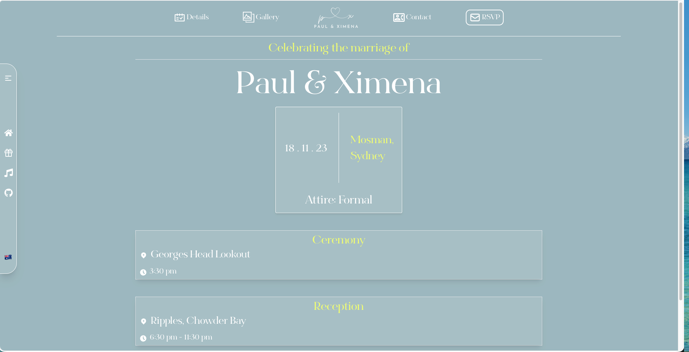

# Paul & Ximena's wedding website

An archived wedding website built for our November 2023 celebration in Sydney. The project is complete and the original deployment is no longer online.



## Highlights

- Responsive landing page with parallax and motion effects
- English and Spanish content using a custom translation hook
- Multi-step RSVP flow with dietary requirements
- Ceremony, reception, wet-weather, story, contact, and registry pages
- Guest photo gallery and uploads backed by Cloudinary
- RSVP storage with Supabase
- Contact form delivery with Nodemailer

## Tech stack

Next.js 13, React, TypeScript, Tailwind CSS, Supabase, Cloudinary, Framer Motion, React Query, and Nodemailer.

## Running locally

This repository is preserved as a completed project. Its former hosted services and deployment are no longer maintained, so integrations require your own environment variables and service configuration.

```bash
npm install
npm run dev
```

Then open `http://localhost:3000`.

## Archive notice

Personal contact and banking details have been removed from the public-facing source. The application is retained for reference and portfolio purposes; some integrations may no longer work with current service or dependency versions.
